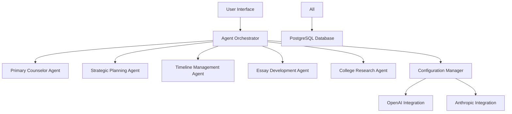
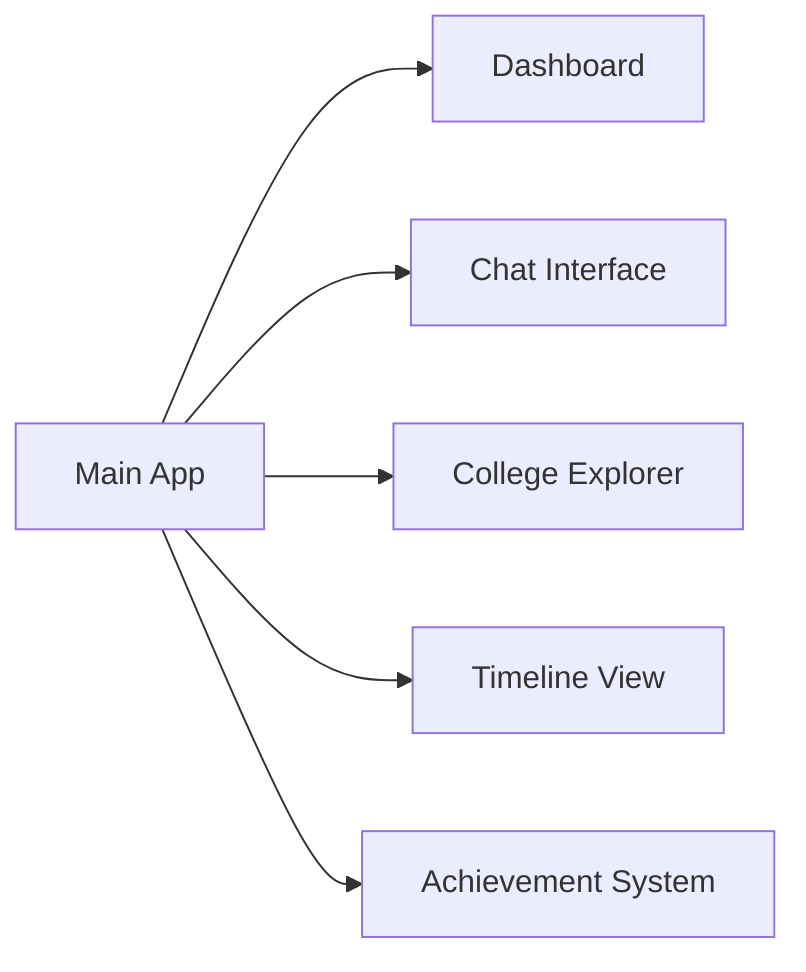

# College Compass: Technical Design Documentation 🎓

## Table of Contents
- [System Overview](#system-overview)
- [Multi-Agent Architecture](#multi-agent-architecture)
- [Configuration System](#configuration-system)
- [User Interface](#user-interface)
- [Database Design](#database-design)
- [Deployment Architecture](#deployment-architecture)

## System Overview

Imagine College Compass as a friendly robot team helping students find their perfect college! 🤖

### Simple Explanation
Think of our system like a big toy factory where different robot helpers work together:
- 👨‍🏫 Main Helper Robot (Primary Counselor): Talks to students and coordinates everything
- 📋 Planning Robot (Strategic Planner): Makes long-term plans
- ⏰ Timeline Robot (Timeline Manager): Keeps track of important dates
- 📝 Essay Robot (Essay Helper): Helps write college essays
- 🔍 Research Robot (College Researcher): Finds the best college matches

### Technical Architecture


## Multi-Agent Architecture

### Simple Explanation
Our robot helpers are like a team of friendly experts:
- One robot is the team captain (Orchestrator)
- Each helper robot has a special job
- They talk to each other using special message cards
- They can switch between different "brains" (LLM providers) to get smarter!

### Technical Implementation
```python
# Agent Communication Example
class AgentMessage:
    def __init__(self, sender: str, content: Dict[str, Any], metadata: Dict[str, Any] = None):
        self.sender = sender
        self.content = content
        self.metadata = metadata or {}
        self.timestamp = datetime.now()
```

## Configuration System

### Simple Explanation
Think of this like a control panel that lets us:
- Switch between different robot brains (OpenAI, Anthropic)
- Change how smart or creative each robot is
- Give robots different personalities
- Make robots work better together

### Technical Details
```yaml
# Example Configuration
agents:
  primary_counselor:
    provider: openai
    model_name: gpt-4-turbo-preview
    temperature: 0.7
    system_prompt_template: templates/prompt/primary_counselor.txt
    fallback:
      provider: anthropic
      model_name: claude-3-sonnet
```

### How It Works
1. ConfigManager loads settings
2. Each agent can use different AI providers
3. Fallback options ensure reliability
4. Environment-specific configurations

## User Interface

### Simple Explanation
The app has different rooms for different activities:
- 💭 Chat Room: Talk to the helper robots
- 📊 Dashboard: See your progress
- 🎯 College Matches: Find perfect schools
- 📅 Timeline: Keep track of dates
- 🏆 Achievements: Celebrate progress!

### Technical Components


## Database Design

### Simple Explanation
We keep track of everything in organized digital filing cabinets:
- 📁 Student Information
- 📁 College Details
- 📁 Application Progress
- 📁 Chat History
- 📁 Achievements

### Schema Overview
```sql
-- Core Tables
Users (id, email, name, created_at)
Profiles (user_id, academic_info, interests)
ChatSessions (id, user_id, agent_id, created_at)
Messages (id, session_id, content, role, timestamp)
Colleges (id, name, details, requirements)
Applications (user_id, college_id, status, deadline)
```

## Deployment Architecture

### Simple Explanation
Our system runs like a well-oiled machine:
- 🖥️ Web Server: Shows the pretty interface
- 🤖 Agent System: Runs the helper robots
- 📦 Database: Stores all information
- ⚙️ Configuration: Controls how everything works

### Technical Stack
- Streamlit: Web interface
- LangChain & LangGraph: Agent framework
- PostgreSQL: Data storage
- OpenAI & Anthropic: AI providers
- Google OAuth: Secure login

## Security and Privacy

### Simple Explanation
We keep everything safe like a digital fortress:
- 🔒 Special keys for each student
- 🛡️ Protected student information
- 🔐 Secure AI communication
- 📱 Safe login system

### Implementation
- API keys stored securely
- Encrypted communication
- Regular security updates
- Privacy-first design

## Future Extensions

### Planned Features
1. More AI providers
2. Advanced essay assistance
3. Real-time college updates
4. Mobile app integration
5. Enhanced personalization

### Integration Points
- Additional LLM providers
- New agent specializations
- Enhanced analytics
- Mobile capabilities

## For Developers

### Getting Started
1. Clone repository
2. Set up environment
3. Configure API keys
4. Run development server

### Best Practices
- Follow coding standards
- Write tests
- Document changes
- Use version control

## Monitoring and Maintenance

### Simple Explanation
We keep everything running smoothly:
- 👀 Watch for problems
- 🔧 Fix issues quickly
- 📈 Track performance
- 🔄 Regular updates

### Technical Implementation
- Error logging
- Performance metrics
- Automated testing
- Regular backups

Remember: This system is designed to be:
- 🎯 Easy to understand
- 🛠️ Simple to maintain
- 📈 Ready to grow
- 🤝 Helper-friendly

Need more details on any part? Just ask! 😊
